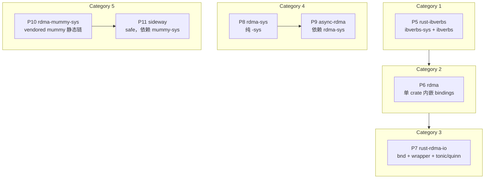

# RDMA 样本横向对照总览（P5–P11）

> **文档性质**：阶段 C 横向对照正文（**RDMA 域内**）。  
> **依据**：各项目 `docs/rdma/**/FFI-ANALYSIS.md`（静态阅读，未构建验证）。  
> **范围**：P5–P11，共 7 个仓库。  
> **非目标**：规范性「应做/不应做」、性能结论、协议语义深读；不替代单项目分析全文。

**交叉链接（阶段 C）**

| 文档 | 内容 |
|------|------|
| [comparison/general-c-ffi.md](../comparison/general-c-ffi.md) | **权威 P1–P11 总表**、模式归纳、例外/专题 |
| 本文档 | P5–P11 补充深读；**五 Category 对照**（§0.7） |

下文 §1 为 P5–P11 **列展开**；与 `general-c-ffi.md` §1 冲突时以 general-c-ffi 为准并应在本文件注明取舍。

**分析完成**：已对 RDMA 下 **7 个样本（P5–P11）** 完成静态 FFI 画像；单项目全文见 `docs/rdma/**/FFI-ANALYSIS.md`（索引：[README.md](./README.md)）。**未执行** `cargo build`；各单篇文档内不做跨项目技术对比。

---

## 0. 范围摘要

| 项 | 约定 |
|----|------|
| **项目子集** | P5 `rust-ibverbs` · P6 `rdma` · P7 `rust-rdma-io` · P8 `rdma-sys` · P9 `async-rdma` · P10 `rdma-mummy-sys` · P11 `sideway` |
| **对照维度** | 见 §1 总表列；§2 按维度展开 |
| **证据深度** | 结论 + 指向单项目 `FFI-ANALYSIS.md` 章节号 |
| **落盘位置** | `docs/rdma/rdma-overview.md`（非 `docs/comparison/`） |

### 0.1 RDMA 样本全景（5 个 category）



| Category | 项目 | 架构要点 |
|----------|------|----------|
| 1 | P5 | `ibverbs-sys` + `ibverbs` |
| 2 | P6 | 单 crate 内嵌 bindings |
| 3 | P7 | bnd + wrapper + tonic/quinn |
| 4 | P8 / P9 | 纯 `-sys` → 依赖 `rdma-sys` 的 async 框架 |
| 5 | P10 / P11 | vendored mummy 静态链 → safe（依赖 mummy-sys） |

### 0.2 项目对照简表（分层 · 绑定 · 链接 · 定位）

| 序号 | 项目 | 分层 | 绑定方式 | 链接策略 | 定位 |
|------|------|------|----------|----------|------|
| P5 | [rust-ibverbs](./category-1/rust-ibverbs/FFI-ANALYSIS.md) | `-sys` + safe | bindgen `verbs.h`；手写 `ibv_wc` | `links=ibverbs`；默认 cmake vendored rdma-core | ibverbs **经典双 crate** 入门 |
| P6 | [rdma](./category-2/rdma/FFI-ANALYSIS.md) | 单 crate | bindgen + `ibverbs.rs` 手写 inline | pkg-config（ibverbs ≥1.14.41，rdmacm ≥1.3.41） | 低层 API + 多 example（含 async 实验） |
| P7 | [rust-rdma-io](./category-3/rust-rdma-io/FFI-ANALYSIS.md) | sys → safe → tonic / quinn | bnd + WinMD；`wrapper.c` 导出 ~96 个 inline | 系统库 + `cc` 编 shim | **最大 workspace**；`Transport` trait + 上层协议适配 |
| P8 | [rdma-sys](./category-4/rdma-sys/FFI-ANALYSIS.md) | 纯 `-sys` | bindgen + `verbs.rs` / `types.rs` 补全 | pkg-config（较旧版本门槛） | 薄绑定；大量 blocklist 复杂类型 |
| P9 | [async-rdma](./category-4/async-rdma/FFI-ANALYSIS.md) | 单 crate 高层框架 | 依赖 crates.io `rdma-sys`；本仓 `build.rs` 只 link | 同 P8 运行时库 | **Agent** + CQ 异步；MR 元数据 / 控制面 |
| P10 | [rdma-mummy-sys](./category-5/rdma-mummy-sys/FFI-ANALYSIS.md) | 纯 `-sys` | bindgen + cmake **静态链** mummy | 编译期不依赖系统 dev 包 | **CI / 无硬件友好**；运行时再 dlopen 真库 |
| P11 | [sideway](./category-5/sideway/FFI-ANALYSIS.md) | safe（依赖 P10） | 绑定在 `rdma-mummy-sys` | 编译 mummy；**运行**要装 rdma-core | 新 **`ibv_wr_*`** API + **`PostSendGuard`** 类型状态 |

### 0.3 共性（面向阶段 C / D）

1. **C 库**：均为 **libibverbs**（± **librdmacm**）；API 以 opaque handle、`ibv_context.ops` 函数表、QP 状态机、WR/CQ 完成为主。
2. **inline 难题**：`ibv_post_send`、`ibv_poll_cq`、`ibv_wr_*` 等多为头文件 inline → 各项目用 **C wrapper**（P7）、**Rust 复现 ops 派发**（P6/P8/P10）、或 **mummy 提供可链接符号**（P10）。
3. **bindgen 策略**：普遍 **blocklist** `ibv_send_wr`、`ibv_wc`、`rdma_cm_event` 等；bitfield 枚举、constified 子模块较常见。
4. **safe 层**：多用 **`Arc` + `Drop` RAII**；P5/P11 强调 **`Send`/`Sync`**；async 路线分 **tokio/epoll CQ**（P7/P9）与 **example 自研驱动**（P6）。
5. **测试环境**：多依赖 **SoftRoCE / rxe / siw**；P10/P11 用 mummy 改善**无 RDMA 时的编译 / CI**。

### 0.4 分层深度（由浅到深）

```text
纯 FFI (-sys)          P8, P10
sys + safe             P5（ibverbs-sys + ibverbs）
内嵌 bindings          P6（单 crate）
sys + 大 safe          P7（rdma-io + Transport）
sys + async 框架       P9（async-rdma → rdma-sys）
mummy + 现代 safe      P11（sideway → rdma-mummy-sys）
```

### 0.5 各项目独有特性

| 项目 | 独有要点 | 证据 |
|------|----------|------|
| **P7** | 在 FFI 之上用 **`Transport` trait** 抽象 SendRecv / CreditRing / ReadRing，再挂 **tonic**（`RdmaConnector` / `RdmaIncoming`）与 **Quinn**（`RdmaUdpSocket`）；上层适配 crate 不新增 C 绑定 | P7 `FFI-ANALYSIS.md` §4.3–§4.4 |
| **P9** | **不重复绑定**；用 **`Agent` + `CQEventListener`** 做 MR 元数据交换与高阶 `read` / `write` / `send` / `receive` API；许可证 **GPL-3.0** | P9 §4、§7 |
| **P11** | 面向 **`ibv_wr_start` / `PostSendGuard`** 的类型状态封装；**trybuild** 约束「一 QP 一 guard」等不变量 | P11 §4.4、§8 |

### 0.6 按 Category 阅读顺序（一句话）

| Category | 项目 | 一句话定位 |
|----------|------|------------|
| 1 | P5 | 经典 **`-sys` + safe** 双 crate；vendored rdma-core 可选 |
| 2 | P6 | **单 crate** 内嵌 bindgen + 手写 inline；低层 API + 多 example |
| 3 | P7 | **最大 workspace**；bnd + wrapper；Transport + tonic/quinn |
| 4 | P8 / P9 | **纯 `-sys`**（P8）→ **async 框架**（P9，依赖 crates.io `rdma-sys`） |
| 5 | P10 / P11 | **mummy 静态链**（P10）→ **现代 verbs safe**（P11，依赖 P10） |

---

## 0.7 五 Category 对照（阶段 C）

与 [general-c-ffi.md](../comparison/general-c-ffi.md) §1 列定义对齐；此处按 **plan category 编号** 归纳演进，**非**技术优劣排序。

### 0.7.1 Category 对照总表

| Category | 代表项目 | 分层模式 | 绑定/inline 路线 | 链接/CI 特征 | 上层/异步 | 索引 |
|----------|----------|----------|------------------|--------------|-----------|------|
| **1** | P5 | `-sys` + safe 双 crate | bindgen + 手写 `ibv_wc`；ops 经 bindgen | `links=ibverbs`；vendored rdma-core 可选 | 无 safe async | P5 §1、§3、§10 |
| **2** | P6 | 单 crate 内嵌 `bindings` | bindgen + **`ibverbs.rs` 手写 inline** | pkg-config；CI 自建 rdma-core | example Tokio 实验 | P6 §1、§3、§8 |
| **3** | P7 | 大 workspace；**tonic/quinn** | **bnd** + **`wrapper.c`** | 系统库 + shim；siw/rxe CI | tokio `AsyncFd` + `Transport` | P7 §1、§3–§4、§7 |
| **4** | P8 → P9 | P8 纯 `-sys`；P9 框架 | P8 手写 `verbs.rs`；P9 **无 bindgen** | pkg-config；P9 依赖 **crates.io `rdma-sys`** | P9 CQ + Agent | P8 §0 · P9 §0、§3、§7 |
| **5** | P10 → P11 | P10 `-sys`；P11 safe | mummy + bindgen/手写；P11 无 bindgen | **静态 mummy**；P11 运行要真库 | P11 Extended API + guard | P10 §2、§10 · P11 §4、§10 |

### 0.7.2 分 Category 叙述（索引）

| Category | 一句话 | 架构决策指向 |
|----------|--------|--------------|
| **1** | 建立 ibverbs **双 crate 样板**（最接近 P1/P2 通用路线） | 何时拆 `-sys`、是否 vendored 头文件 → P5 §10 |
| **2** | 降低 workspace 成本；低层 API + **多 example** 探路 | 单 crate 内嵌 vs 独立 sys → P6 §10 |
| **3** | **工程化**：生成绑定检入 + C wrapper + **传输抽象** + 云原生协议 | wrapper vs 手写 ops；上层零 FFI → P7 §10 |
| **4** | **绑定层与框架层分离**；datenlord 系 GPL async | 复用 crates.io `-sys` vs 自维护 → P9 §10 |
| **5** | **CI 友好 mummy** + 现代 **Extended Verbs** safe | 编译/运行分离；类型状态 API → P10 §10、P11 §10 |

### 0.7.3 Category 内差异（同 category 多项目）

| Category | 对比 | 要点 | 索引 |
|----------|------|------|------|
| **4** | P8 vs P9 | P8 本仓维护完整 bindgen+`verbs.rs`；P9 锁定 **`rdma-sys` 0.3.0**，本仓只做 tokio/MR 控制面 | P8 §3 · P9 §1、§3 |
| **4** | 与工作区关系 | P9 **未** vendored 工作区 P8；符号级差异未测 | P9 §11 |
| **5** | P10 vs P11 | P10 解决**链接期**符号；P11 押注 **`ibv_wr_*`** + `PostSendGuard` | P10 §4 · P11 §4.4 |
| **5** | 运行依赖 | 二者编译链 mummy；P11 **运行**仍需系统 rdma-core | P11 §2 |

**演进轴线（样本编排顺序，非性能排序）**

```text
C1 双 crate 入门 (P5)
 → C2 单 crate + inline 手写 (P6)
 → C3 wrapper + workspace + 协议适配 (P7)
 → C4 纯 sys / 外置 sys + async 框架 (P8 / P9)
 → C5 mummy + 现代 safe (P10 / P11)
```

---

## 1. 对照总表

行 = 项目；列 = 维度。单元格：**结论** → 证据（`FFI-ANALYSIS.md` 章节）。

| 维度 | P5 rust-ibverbs | P6 rdma | P7 rust-rdma-io | P8 rdma-sys | P9 async-rdma | P10 rdma-mummy-sys | P11 sideway |
|------|-----------------|---------|-----------------|-------------|---------------|-------------------|-------------|
| **C 库** | libibverbs | ibverbs + rdmacm | ibverbs + rdmacm | ibverbs + rdmacm | 经 `rdma-sys` | ibverbs + rdmacm（mummy） | 经 `rdma-mummy-sys` |
| **Crate 分层** | `ibverbs-sys` + `ibverbs` | 单 crate（`bindings` + safe） | 6 成员 workspace（sys→io→tonic/quinn） | 单 crate 纯 `-sys` | 单 crate 高层；依赖外部 `-sys` | 单 crate 纯 `-sys` | 单 crate safe |
| **绑定工具** | bindgen | bindgen | **bnd** + WinMD | bindgen | **无**（用 `rdma-sys`） | bindgen | **无**（依赖 P10） |
| **inline 策略** | 经 `ops` 表（bindgen 函数） | 手写 `ibverbs.rs` | **wrapper.c**（~96 符号） | 手写 `verbs.rs` | 在 `rdma-sys` | 手写 `verbs.rs` + mummy 符号 | 调用 mummy 导出 |
| **链接 / 分发** | `links=ibverbs`；cmake vendored 或系统 | pkg-config；无 `links` | 系统库 + `cc` 编 wrapper | pkg-config；无 `links` | `build.rs` link + `rdma-sys` pkg-config | **静态** mummy；无 pkg-config | 编译链 mummy；**运行**要系统 rdma-core |
| **rdmacm safe** | 无 | 已 bindgen，**未用** | 有（`cm` / `async_cm`） | 仅 FFI | `cm` feature | 仅 FFI（examples） | 有（`rdmacm` 模块） |
| **扩展 API**（`ibv_wr_*` / ex CQ） | 未重点封装 | `ibverbs.rs` 有；safe 偏 legacy WR | wrapper 覆盖 | `verbs.rs` 覆盖 | 经 `rdma-sys` | `verbs.rs` 覆盖 | **设计重心** + `PostSendGuard` |
| **资源模型** | `Arc` RAII | `Arc<Owner>` + `WeakSet` | `Arc` 父子树 | 裸指针，无 RAII | `Arc` + Agent/MR 协议 | 裸指针 | `Arc` + 类型状态 guard |
| **错误模型** | `io::Error` | crate `error` | `thiserror` `Error` | C errno；无统一 Rust 枚举 | `thiserror` + `io::Error` | C errno | `thiserror` 分模块 |
| **Async** | 无（nix `poll` 阻塞 wait） | example 自研（Tokio） | tokio `AsyncFd` + Transport | 无 | **核心**：CQ task + Agent | 无 | 无 |
| **上层适配** | 无 | example `rdma-async` | **tonic** / **quinn** crate | 无 | 无（自身为框架） | 无 | 无 |
| **无硬件 CI** | 需子模块/系统库；CI 装 dev 包 | CI 自建 rdma-core | siw + rxe 双 job | rxe + `run.sh` | submodule 软 RDMA | **`cargo build` only** | mummy 编译 + 运行要库 |
| **Mock / mummy** | 无 | 无 | 无 | 无 | 无 | **有**（P10） | 编译依赖 P10 |
| **许可证** | MIT/Apache-2.0 | MIT | MIT | （见仓库 LICENSE） | **GPL-3.0** | （见仓库） | MPL-2.0 |

---

## 2. 分维度叙述

### 2.1 Crate 分层与职责边界

**共性**：全部围绕 **rdma-core** 用户态栈；数据面以 verbs 为主，连接面可选 **librdmacm**。

**差异**：

- **双 crate 经典路线（P5）**：`-sys` 可单独发布；safe 层只依赖 `ibverbs-sys`。与 P1 `libz-sys` + `flate2` 模式最接近，但多了 vendored rdma-core 与 `ibv_wc` 手写。→ P5 §1、§4；P5 §10 决策 1。
- **单 crate 内嵌（P6）**：降低 workspace 成本，`pub mod bindings` 对外可见；librdmacm 已生成但 safe 未接。→ P6 §1.1、§3.2、§4。
- **多 crate + 上层适配（P7）**：唯一将 **gRPC/QUIC** 接到 RDMA 字节流的样本；FFI 止于 `rdma-io`，tonic/quinn **零新增 `extern "C"`**。→ P7 §4.3–§4.4、§10。
- **`-sys` 与框架分离（P8/P9）**：P8 与 P6/P10 绑定策略相近但无 safe；P9 通过 crates.io **`rdma-sys`** 复用绑定，本仓只做 tokio 与 MR 控制面。→ P8 §0；P9 §1.1、§3。
- **mummy 栈（P10/P11）**：P10 解决 **链接期** 头文件与符号；P11 在 safe 层押注 **Extended Verbs API**。→ P10 §2.2；P11 §4.3、§10。

### 2.2 绑定生成与 inline 处理

RDMA 绑定的**首要难点**是 C 头中大量 **`static inline`** 与 **union 结构**（`ibv_wc`、`ibv_send_wr`、`rdma_cm_event`）。

| 策略 | 采用项目 | 机制 | 权衡 |
|------|----------|------|------|
| **bindgen + blocklist + 手写类型** | P5、P8、P10 | blocklist 复杂类型；`types.rs` 或单文件手写 `ibv_wc` | 维护成本高；与上游版本强耦合 |
| **bindgen + 大块 `verbs.rs` 复刻 inline** | P6、P8、P10 | `container_of`、`ibv_context.ops`、`ibv_qp_ex` 函数指针 | 行数多（P8/P10 ~1300 行）；可精确匹配 C 语义 |
| **C wrapper 导出符号** | P7 | `wrapper.c` + bnd 第三分区 | 链接真实 inline；需 `cc` 与系统头；生成物检入仓库 |
| **bnd / WinMD** | P7 | 非 bindgen；分区 ibverbs / rdmacm / wrapper | 工具链特殊；与 Windows 绑定生态同源 |
| **依赖上游 `-sys`** | P9、P11 | 不在本仓 bindgen | 版本锁定（P9 → `rdma-sys 0.3.0`；P11 → `rdma-mummy-sys 0.2.3`） |

**`ibv_reg_mr` / `ibv_query_port`**：P6 blocklist 后由 `ibverbs.rs` compat 提供；P10 bindgen 将 `ibv_query_port` 重命名为 `ibv_query_port_compat`（`CompatParseCallback`）。→ P6 §3.1；P10 §3。

### 2.3 链接策略与可复现构建

| 模式 | 项目 | 典型场景 |
|------|------|----------|
| **Vendored rdma-core（cmake）** | P5 | docs.rs / 无系统 dev 包头文件；`RDMA_CORE_*` 覆盖 |
| **仅系统 pkg-config** | P6、P7、P8 | 开发机 / CI 预装 rdma-core；版本下限各异（P6 ≥1.14.41，P8 ≥1.8.28） |
| **静态 mummy** | P10 | CI `cargo build` 无需 `libibverbs-dev`；运行时再 dlopen |
| **`links` 键** | P5（`ibverbs`） | Cargo 原生库去重；其余多数 **无** `links` |

**版本门槛分散**：P8 的 pkg-config 下限明显低于 P6/P7，绑定的是较老 API 快照，与「追新 verbs」的 P6/P11 形成对照。→ P8 §2.2；P6 §2.3。

### 2.4 Safe 层、资源生命周期与 API 覆盖面

| 项目 | Safe 厚度 | 突出机制 | verbs 覆盖面（相对 full rdma-core） |
|------|-----------|--------------|-------------------------------------|
| P5 | 中 | RC QP 握手、`post_*`、CQ poll/wait；`PORT_NUM=1` 硬编码 | 子集：无 SRQ/AH 等 |
| P6 | 中–高 | `WeakSet` 解 CQ↔CompChannel 环；模块分文件 | 较全；CM 未接 safe |
| P7 | 高 | `Transport` 抽象三种传输；双 CQ 全双工 stream | 较全 + CM async |
| P8 | 无 | — | FFI 全集倾向（手写补全） |
| P9 | 高（语义层） | MR 元数据 Agent；远端 MR 租约 | 常用路径；非 general-purpose verbs |
| P11 | 高（verbs 现代 API） | Basic/Extended 双轨；`PostSendGuard` 类型状态 | 明确排除 MAD/UMAD 等 |

**RDMA CM**：P7/P11 在 safe 层完整度最高；P5/P6 示例常用 **TCP OOB** 交换 QP 元数据而非 CM。→ P6 §1.3；P11 §4.5。

### 2.5 错误、安全边界与 `unsafe`

- **统一 Rust 错误枚举**：P7、P9、P11 使用 `thiserror`；P5 用 `io::Error`；P8/P10 以 C 返回码为主。
- **`unsafe` 集中处**：P5 `post_send`/`post_receive` 等；P6 `post_*` 带 TODO safety；P11 将 WR 构建收口到 guard，**compiletest** 约束误用。→ P11 §8。
- **双路径 errno**：P7 区分 ibverbs 负返回值与 rdmacm `-1`+`errno`。→ P7 §3.3、§6。

### 2.6 并发与 Async

| 项目 | 模型 |
|------|------|
| P5 | 同步 API；`CompletionQueue::wait` 用 nix poll；声明全类型 `Send`/`Sync` |
| P6 | 库本身同步；`rdma-async` example 用 **专用线程** poll CQ + Tokio channel |
| P7 | `AsyncCq`（epoll/`AsyncFd`）；`AsyncRdmaStream` 实现 `AsyncRead`/`AsyncWrite` |
| P8/P10/P11 | 无 executor 集成 |
| P9 | **CQEventListener** + tokio task；`wr_id` 映射到 oneshot/mpsc；GPL 许可 |

**模式归纳**：RDMA async 无统一标准——样本分别采用 **阻塞 wait（P5）**、**线程+channel（P6 example）**、**tokio AsyncFd（P7/P9）**。

### 2.7 测试、示例与无硬件 CI

| 项目 | 测试形态 | 无真实 NIC 时 |
|------|----------|----------------|
| P5 | crate 内单元测试 + CI `cargo test` | 需 dev 包 / vendored 头；SoftRoCE 实测 |
| P6 | 模块内单测；无 `tests/` | CI 编译 rdma-core |
| P7 | `rdma-io-tests` 集成；siw/rxe | 脚本 `setup-siw.sh` / `setup-rxe.sh` |
| P8 | 无 crate 单测；`run.sh` + examples | rxe |
| P9 | 多文件集成测试；`rdma-env-setup` | 软 RDMA |
| P10 | **无** `#[test]`；CI 仅 build | mummy 链成功即可编译 |
| P11 | 集成测试 + trybuild + codecov | 同 P10 编译模型；运行要系统库 |

**P10** 最适合作为「**CI 友好 `-sys` 底座**」证据；**P11** 展示在其上叠 modern safe API + 编译期约束。

### 2.8 上层适配（协议 / 运行时）

仅 **P7** 具备独立发布 crate：

| Crate | 做了什么 | FFI 边界 |
|-------|----------|----------|
| `rdma-io-tonic` | `RdmaConnector` / `RdmaIncoming` | 仅 `rdma-io::Transport` + tokio IO 桥 |
| `rdma-io-quinn` | `RdmaUdpSocket` → Quinn `AsyncUdpSocket` | 同上 |

**P9** 自身是应用级框架（MR 交换、read/write/send API），不是 tonic/quinn 适配器。→ P7 §4.3–§4.4；P9 §4。

---

## 3. 模式归纳（FFI 架构分类）

```text
                    ┌─────────────────────────────────────────┐
                    │           应用 / 协议层                  │
                    │  P7-tonic/quinn  P9-Rdma API  P6-async ex │
                    └─────────────────┬───────────────────────┘
                                      │
          ┌───────────────────────────┼───────────────────────────┐
          │                           │                           │
    ┌─────▼─────┐              ┌──────▼──────┐             ┌──────▼──────┐
    │ Safe verbs │              │  Transport  │             │  Agent/CQ   │
    │ P5 P6 P11  │              │    P7       │             │    P9       │
    └─────┬─────┘              └──────┬──────┘             └──────┬──────┘
          │                           │                           │
          └───────────────────────────┼───────────────────────────┘
                                      │
                    ┌─────────────────▼───────────────────┐
                    │  -sys / bindings（bindgen|bnd|mummy）  │
                    │  P5-sys  P6-bind  P7-sys  P8 P10       │
                    └─────────────────┬───────────────────┘
                                      │
                    ┌─────────────────▼───────────────────┐
                    │   libibverbs.so  librdmacm.so        │
                    │   （或 mummy → dlopen 真实库）         │
                    └─────────────────────────────────────┘
```

| 模式 ID | 描述 | 代表项目 |
|---------|------|----------|
| **M1** | 独立 `-sys` + safe 双 crate | P5 |
| **M2** | 单 crate 内嵌 bindings + safe | P6 |
| **M3** | 大 workspace：sys → safe → 协议适配 | P7 |
| **M4** | 纯 `-sys`（手写 verbs 补 inline） | P8、P10 |
| **M5** | 外部 `-sys` + 单 crate async 框架 | P9 |
| **M6** | mummy `-sys` + modern safe（类型状态） | P10 + P11 |

**演进轴线（按 plan category 编号，非技术优劣）**：

1. Category 1：建立 ibverbs 双 crate 样板（P5）  
2. Category 2：单仓低层 API + 实验性 async example（P6）  
3. Category 3：工程化 workspace + 传输抽象 + 云原生协议（P7）  
4. Category 4：datenlord 系 `-sys` 与 GPL async 框架（P8→P9）  
5. Category 5：RDMA-Rust 系 mummy 与 Extended Verbs safe（P10→P11）

---

## 4. 未覆盖项

| 项 | 原因 |
|----|------|
| P1–P4 与 RDMA 的横向对照 | 见 [comparison/general-c-ffi.md](../comparison/general-c-ffi.md) §1、§3–§5 |
| 五 Category 对照 | 本文 §0.7 |
| 性能、延迟、吞吐 | 非目标 |
| 各厂商 OFED / 驱动差异 | 未读上游驱动实现 |
| `cargo build` / ABI 实测 | 阶段 A/B 裁定不构建 |
| P9 与**本工作区** P8 源码差异 | P9 依赖 crates.io `rdma-sys`，未 vendored 对比符号级差异 |
| 同 category 细表 | 已并入本文 §0.7.3 |
| 规范性最佳实践 | 阶段 D `docs/guide/` |

---

## 5. 证据索引（总览级）

| 主题 | 优先阅读 |
|------|----------|
| 双 crate + vendored | P5 §2、§3、§10 |
| 内嵌 bindgen + inline 手写 | P6 §3、§4 |
| bnd + wrapper + Transport | P7 §3、§4、§7 |
| 纯 sys + CM examples | P8 §3、§8 |
| async + Agent | P9 §4、§7 |
| mummy 静态链 | P10 §2、§10 |
| Extended API + PostSendGuard | P11 §4、§8、§10 |

---

## 修订记录

| 日期 | 变更 |
|------|------|
| 2026-05-18 | 初稿：基于 P5–P11 单项目 `FFI-ANALYSIS.md` 汇总 |
| 2026-05-18 | §0 增补：阶段 B 分析摘要、样本全景图、对照简表、共性、分层深度、独有特性 |
| 2026-05-18 | §0.7：五 Category 对照总表、分 category 叙述、C4/C5 内差异 |
