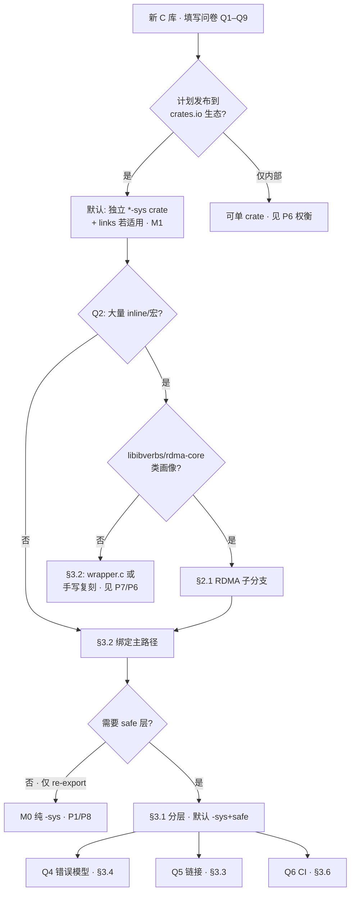
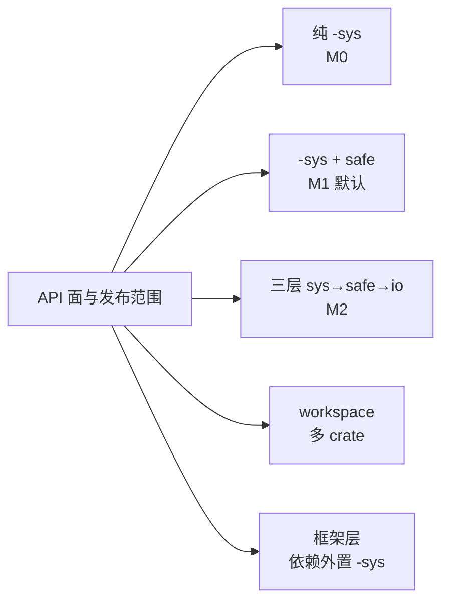
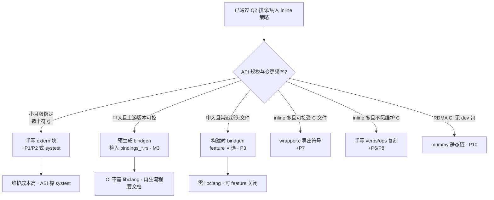

# FFI 架构决策

> **状态**：阶段 D 正文（2026-05-18）。  
> **读者**：团队维护、拟发布到 Rust 生态的 **C / `extern "C"`** 绑定项目。  
> **证据**：[general-c-ffi.md](../comparison/general-c-ffi.md)、[rdma-overview.md](../rdma/rdma-overview.md)、`docs/**/FFI-ANALYSIS.md`。  
> **语气**：核心分支有**默认推荐**；并列选项附样本索引（裁定 D1=C）。

---

## 1. 库画像问卷（绑定前必答）

在走决策树前，由维护者共同填写（可贴进 ADR，见附录 A）。

| # | 问题 | 影响分支 |
|---|------|----------|
| Q1 | API 以 **opaque 指针**、**函数表/ops** 还是**值结构体**为主？ | 绑定工具、手写量、blocklist |
| Q2 | 是否存在大量 **`static inline`**、**宏**、**union 载荷**？ | [§3.2 绑定](#32-绑定手写--bindgen--预生成--wrapper) · RDMA [§2.1](#21-rdmaverbs-画像子分支) |
| Q3 | 资源是否有清晰 **create/destroy**？是否 **引用计数**？ | RAII / `foreign-types` / 裸 `-sys` |
| Q4 | 错误是 **errno**、**整型返回码** 还是 **错误栈/队列**？ | safe 层 `Error` 形状 |
| Q5 | 分发：**仅系统库** / **可 vendored** / **需多后端**？ | `build.rs` · `links` |
| Q6 | CI 是否必须 **无原生 dev 包** 或 **无专用硬件**？ | systest · mummy · 软设备 |
| Q7 | 下游是否需要 **独立 `-sys` crate**（semver、重复链接）？ | workspace 拆分 |
| Q8 | 许可证是否允许 **GPL/MPL** 等传染？ | 依赖 P9 类框架 → [general-c-ffi §4 S5](../comparison/general-c-ffi.md#s5--p9外置-rdma-sys非工作区-p8) |
| Q9 | 是否计划在 **safe 层之上** 再挂协议/运行时（gRPC、QUIC 等）？ | 上层 crate 零新增 `extern "C"` → P7 |

---

## 2. 总览决策树



**默认立场（团队可维护 / 生态共享）**

- 对外 crate：**独立 `foo-sys`** + 可选 `foo`，`-sys` 上 semver 保守（`0.x` 常见）。  
- **绑定**：无 inline 难题时，优先 **预生成 bindgen 或高质量手写 + systest**（§3.2）。  
- **链接**：能共享系统库则文档化探测顺序；docs.rs / CI 再考虑 vendored（P1、P2、P4）。  
- **证据索引**：模式表 [general-c-ffi §3](../comparison/general-c-ffi.md#3-模式归纳架构决策向)。

---

## 2.1 RDMA/verbs 画像子分支

> RDMA **不是**另一套 FFI 范式，而是 **Q2=大量 inline** + **特定 C 库** 的组合（裁定 D2=B）。  
> Category 演进见 [rdma-overview §0.7](../rdma/rdma-overview.md#07-五-category-对照阶段-c)。

| 若… | 考虑 | 样本 |
|-----|------|------|
| 要 **无 libibverbs-dev 的 CI 编译** | mummy 静态链 | P10 → P11 |
| 要 **可链接真实 inline** 且可维护 | `wrapper.c` + 生成绑定 | P7 |
| 接受 **手写 ops 派发**、单仓 | 大块 `verbs.rs` | P6、P8 |
| 只做 **框架**、绑定外包 | 依赖 crates.io `rdma-sys` | P9（注意 **GPL-3.0**） |
| 经典 **双 crate 入门** | `ibverbs-sys` + safe | P5 |

**勿默认**：工作区外的 P8 与 P9 所用 `rdma-sys` **不是同一交付物** → [general-c-ffi S5](../comparison/general-c-ffi.md#s5--p9外置-rdma-sys非工作区-p8)。

---

## 3. 分主题决策树

### 3.1 分层与 crate



| 选项 | 何时选 | 默认? | 样本 |
|------|--------|-------|------|
| **纯 `-sys`** | 官方推荐上层 crate（如 flate2）；或仅 FFI 表 | 仅当明确不维护 safe | P1、P8、P10 |
| **`-sys` + safe** | 生态主消费 safe API | **是**（团队对外发布） | P2、P5、P11 |
| **三层** | safe 仍偏薄，需 Ergonomic API 层 | 大库、稳定 C API | P4 |
| **workspace** | API 面极大、多后端、上层适配 | OpenSSL/RDMA 级 | P3、P7 |
| **框架 + 外置 `-sys`** | 绑定由他人维护 | 确认许可证与版本 pin | P9、P11 |

**团队默认**：`yourlib-sys`（`links` 若需要）+ `yourlib`；宏/错误子 crate 按需（P3）。

---

### 3.2 绑定：手写 vs bindgen vs 预生成 vs wrapper

**本节为阶段 D 必显式覆盖项**（裁定 D13）。



| 路径 | 优点 | 成本 | 代表样本 |
|------|------|------|----------|
| **手写** | 无 libclang；可只绑稳定子集；类型命名可控 | 漂移需 **systest** 守 ABI | P1、P2 |
| **预生成 bindgen** | 构建快；docs.rs 友好；feature 组合可检入多文件 | 升级上游要 **再生命令** | P4 |
| **构建时 bindgen** | 易追新头文件；可 `cfg` 裁剪 | CI 复杂；绑定体积大 | P3、P5（部分） |
| **bindgen + blocklist + 手写类型** | 复杂 union/bitfield 可控 | 双轨维护 | P5、P8 |
| **wrapper.c + bindgen/bnd** | 真实链接 inline | 需 `cc`、系统头 | P7 |
| **手写 inline 复刻** | 单 crate、无 C 文件 | 行数大、与头文件强耦合 | P6、P8、P10 |
| **mummy** | 编译期无系统 rdma dev | 运行期仍可能要真库 | P10 |

**团队默认推荐（无 inline 或已用 wrapper 解决）**

1. **首选**：**预生成 bindgen** + 文档化 `regenerate.sh` + **systest**（P4 路线）。  
2. **次选**：**手写** + **systest**，当 API 面 &lt; ~100 符号且多年不变（P1/P2）。  
3. **慎选**：构建时 bindgen 作为 **默认 feature**，保留手写 fallback（P3）。  
4. **勿**：无测试的大手写文件（见 [反模式](./rust-ffi-best-practices.md#7-反模式)）。

**与 safe 的关系**：绑定策略在 **`-sys` 层** 决定；safe 层不重复 bindgen（P9、P11）。

---

### 3.3 链接与分发

| 策略 | 适用 | 样本 |
|------|------|------|
| **`links = "native"`** | 防多 crate 重复链接同一 .so | P1、P2、P3、P4、P5 |
| **pkg-config 优先** | Linux 发行版装 dev 包 | P6、P7、P8 |
| **默认 vendored** | 上游头文件/版本难统一 | P2、P4 |
| **vendored 可选 feature** | docs.rs + 系统库双支持 | P1、P5 |
| **符号隐藏 / 静态专用宏** | 避免与系统库 **ODR 冲突** | P4 |
| **mummy 静态 + 运行 dlopen** | CI 编译 | P10 |

**默认**：README 写清「探测顺序」；`build.rs` 顶部注释决策树（P1 §2.3、P2 §2.3）。

---

### 3.4 错误模型

| C 库习惯 | safe 层默认 | 样本 |
|----------|-------------|------|
| `int` 返回码 + 可选消息 | `Result<_, Error>` 或 `io::Error` | P2、P5 |
| `size_t` + `isError()` | `SafeResult` / 专用 `ErrorCode` | P4 |
| OpenSSL ERR 栈 | `ErrorStack` | P3 |
| errno | `io::Error::last_os_error()` 或包装 | P8、P10 |
| 框架 thiserror | 分模块 enum | P7、P9、P11 |

**默认**：`-sys` **不** 强行 `Result`；在 safe 边界统一映射（P4 §6）。

---

### 3.5 并发与 async

| 需求 | 做法 | 样本 |
|------|------|------|
| 无 | 同步 API | P1–P5、P8、P10、P11 |
| 多路复用 | 暴露 C 多路 API + 文档化线程规则 | P2 `multi` |
| 库内 tokio | CQ/fd + `AsyncFd` | P7、P9 |
| async 外置 | README 指向专用 crate | P4 → `async-compression` |

**默认**：绑定层 **不** 强绑 tokio；async 由上层或独立 crate 集成（生态友好）。

---

### 3.6 测试与 CI

| 目标 | 做法 | 样本 |
|------|------|------|
| ABI 不回退 | `systest` / `ctest2` | P1–P3 |
| 无硬件可编译 | mummy 或仅 `cargo build` | P10 |
| 集成需设备 | 软 RDMA / 子模块 | P7、P9 |
| 不变量 | trybuild | P11 |

**默认**：对外 `-sys` **应有** ABI 测试；集成测试标 `#[ignore]` + 文档（P7 §8）。

---

## 4. 与样本对照表

| 决策点 | 采用样本 | 索引 |
|--------|----------|------|
| 纯 `-sys` | P1、P8、P10 | P1 §0；P8 §0；P10 §0 |
| 双 crate sys+safe | P2、P5 | P2 §1；P5 §1 |
| 三层 | P4 | P4 §1 |
| workspace + 手写/bindgen 混合 | P3 | P3 §1、§10 |
| 预生成 bindgen | P4 | P4 §3、§10 |
| 手写绑定 | P1、P2 | P1 §3；P2 §3 |
| wrapper.c | P7 | P7 §3 |
| mummy | P10 | P10 §2、§10 |
| 外置 `-sys` | P9、P11 | P9 §3；P11 §2 |
| 上层零 FFI 适配 | P7 | P7 §4.3–§4.4 |

---

## 附录 A — 决策记录模板（可选 ADR）

> 裁定 D7=B：不强制每库 ADR；发版前建议存档一份。

```markdown
## ADR-NNN：<项目> FFI 架构

- **日期**：
- **维护者**：
- **问卷**：Q1=… Q2=…（见 architecture-decisions.md §1）
- **决定**：
  - 分层：（例）`foo-sys` + `foo`
  - 绑定：（例）预生成 bindgen + systest
  - 链接：（例）pkg-config 优先，feature `vendored`
- **备选**：曾考虑手写 / 构建时 bindgen 及放弃原因
- **证据**：→ P4 §10.2；general-c-ffi M3
- **后果**：semver、CI 矩阵、下游 feature
```

---

## 附录 B — 虚构库演练（裁定 D12）

**画像：`libchart`** — 虚构的 C 图表库，供团队走查决策树（非真实项目）。

| 问卷项 | 答案 |
|--------|------|
| Q1 | 主要是 `chart_ctx*` opaque + 若干 `chart_*()` |
| Q2 | **无** 大量 inline |
| Q3 | `chart_create` / `chart_destroy` |
| Q4 | `chart_status` 枚举返回码 |
| Q5 | 上游提供 `.pc`，Linux 常见系统包 |
| Q6 | CI 仅需 `libchart-dev` 或 vendored feature |
| Q7 | 计划 **crates.io** 发布 |
| Q8 | MIT |
| Q9 | 无 |

**走树结果**

1. **分层**：`chart-sys` + `chart`（§3.1 默认 B）。  
2. **绑定**：§3.2 → API 中等、头文件稳定 → **预生成 bindgen** + `systest`（对标 P4）；若符号 &lt; 40 且三年无 ABI 变更可改手写（P2）。  
3. **链接**：`links = "chart"` + pkg-config 优先，feature `vendored` 服务 docs.rs（P1/P5）。  
4. **错误**：`-sys` 暴露返回码；`chart` 映射为 `Result<_, ChartError>`（P2/P5）。  
5. **async**：无（§3.5）。  
6. **CI**：`systest` 必开；集成测试 mock 数据，不依赖 GPU。

**若改名为 `libverbs-fake`（inline 多）**：Q2=是 → §2.1 → 在 wrapper.c（P7）与 mummy（P10）间按 CI 选型，**不** 直接构建时 bindgen 整头文件。

---

## 修订记录

| 日期 | 变更 |
|------|------|
| 2026-05-18 | 阶段 D 正文：问卷、总览树、分主题树（含手写/bindgen）、RDMA 子分支、样本表、附录 ADR + 虚构演练 |
