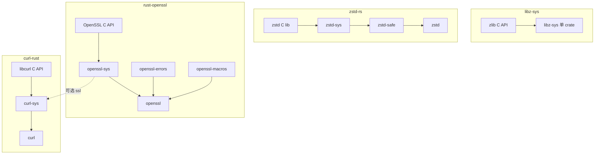

# 四项目 FFI 设计对比

本文对齐同一组维度，比较工作区内四个样本：`libz-sys`、`zstd-rs`（含 `zstd-safe` / `zstd-sys`）、`rust-openssl`（含 `openssl-sys` / `openssl` 等）、`curl-rust`（含 `curl-sys`），并给出 **架构决策矩阵**（§总览后）以支持选型。

## 总览

| 项目 | 主要用途 | `links` | 典型分层 | 绑定生成 |
|------|----------|---------|----------|----------|
| libz-sys | 压缩（zlib） | `z` | 单层 `-sys` | 手写 `extern` + 类型别名 |
| zstd-rs | 压缩（zstd） | `zstd`（在 zstd-sys） | 三层：`zstd` / `zstd-safe` / `zstd-sys` | 默认 bindgen（可关）；可选 pkg-config 链系统 libzstd |
| rust-openssl | 加密/TLS | `openssl` | `openssl-sys` + `openssl` + `openssl-errors` / `openssl-macros` | 可选 bindgen；大量手写与版本 cfg |
| curl-rust | HTTP 客户端 | `curl`（在 curl-sys） | `curl` + `curl-sys`（可选 openssl-sys 等） | curl-sys 以预生成/手写为主，build 编 vendored curl 或链系统库 |

## 架构决策矩阵（支持选型，而非仅「像谁」）

下列维度用于**对照你的 C 库画像**（见 [methodology-any-c-project.md](methodology-any-c-project.md) §1）做架构决策；样本行为为数据点，不是教条。

| 维度 | libz-sys | zstd-rs | rust-openssl | curl-rust | 备注 |
|------|----------|---------|---------------|------------|------|
| **C API 形态** | 缓冲区 + `z_stream` 状态 | 压缩流/块 + 上下文句柄 | 句柄 + X509/SSL 栈 + 错误栈 | 句柄 + **回调** + `Multi` I/O | RDMA 见 [rdma-ffi-schemes.md](rdma-ffi-schemes.md)（completion + ops） |
| **主要 unsafe 来源** | 裸指针与缓冲配对 | FFI 码流 + 上下文指针 | 指针 + **版本 cfg** + 栈错误 | 回调 + 全局 init + 多句柄 | 回调型必读 curl panic 模式 |
| **safe 层策略** | 薄（调用方管不变量） | **safe-low** + `Drop`/错误码 | **foreign-types**、宏、`Drop` | **panic 边界**、`Error`、资源封装 | 见方法论 §4 准入标准 |
| **构建复杂度** | 系统链 / 自带编 zlib | bindgen 可选 + cc vendored | 探测 + vendored + 多后端 | vendored curl 或系统 + 多 TLS feature | 预生成 / mummy 等见方法论 §2.1 |
| **async/并发（crate 内）** | 无（同步 CPU） | 无 | 阻塞 IO | **readiness：`Multi`** | RDMA：CQ **completion**；`async-rdma` 为生态层 |
| **较适用** | 面小、不变量简单、希望 `-sys` 即终点 | 要 **no_std 与 std** 分层、热 API 稳定 | 超大面、版本多、要强类型 | 回调密集、网络协议栈 | 见各节「不适用」 |
| **较不适用 / 风险** | 新手误用 `z_stream` | 维护 bindgen/feature | 构建与 **OpenSSL 版本** 拖 CI | 回调生命周期与 panic | RDMA：`verbs.h` 见 RDMA 文 |

输出正式设计文档时，请套用 [design-output-template.md](design-output-template.md)。

## 分层与依赖（示意）

---

## libz-sys

### 出发点

- 为 **zlib / zlib-ng** 提供 Rust 可见的 FFI 与链接脚本；调用方通常直接在此层或再自建薄封装。
- 使用 `links = "z"`，与 Cargo 的「单构建实例」语义配合，避免重复链接冲突。

### 架构

- **单 crate**：无单独的「人体工程学」上层；安全责任大量落在调用方（正确维护 `z_stream`、缓冲区指针等）。
- 通过 **cfg 与宏**（如 `if_zng!`、`zng_prefix!`）抹平 zlib 与 zlib-ng 的符号/类型差异。

### 构建与探测

- `build.rs`：`pkg-config` 探测 include（且刻意 `print_system_libs(false)` 等，减少污染全局 `-L`）、Windows `vcpkg`、Android/Haiku/OHOS 直接链系统 `z`、否则检测是否已装 zlib 再决定 `build_zlib` 用 `cc` 编自带 C 源码。
- **静态/动态** 由环境与 feature（如 `stock-zlib`、`zlib-ng`）组合驱动。

### 安全与错误

- 类型多为 `#[repr(C)]` 结构与裸指针；**无**统一 Rust `Error` 类型，错误码即 C API 语义。
- 资源生命周期（`inflateEnd` 等）需调用方配对；crate 不强制 `Drop` 包装。

### 异步

- 无；纯 CPU/缓冲同步 API。异步见 [async-ecosystem.md](async-ecosystem.md)。

### 特殊点

- **Z_SOLO** 等 wasm 路径：削减对外 libc 依赖。
- zlib-ng 与 stock zlib 的 **符号前缀** 与类型宽度差异集中处理，是可复用的「多后端同一 Rust API」模式。

---

## zstd-rs（zstd / zstd-safe / zstd-sys）

### 出发点

- 在保持与 C 库 **接近 1:1 的底层 API** 的同时，提供 **no_std 友好** 的中间层与 **std::io** 流式上层。

### 架构

| Crate | 职责 |
|-------|------|
| `zstd-sys` | `links`、编译/链 zstd C 库、（默认）bindgen 出 FFI；feature 控制 legacy、多线程、experimental、seekable 等。 |
| `zstd-safe` | `no_std`；把 `usize` 返回码解析为 `SafeResult`；再导出 `zstd_sys`；大量函数为薄包装。 |
| `zstd` | `std`；`Read`/`Write` 流、便捷函数；错误映射到 `io::Error` 等。 |

### 构建

- `zstd-sys/build.rs`：`feature "bindgen"` 时用 bindgen（`use_core()`、`rustified_enum`、条件头文件）；否则可走自带 `cc` 编译 vendored `zstd/lib`；`pkg-config` feature 链系统 `libzstd`。
- `zstd-safe/build.rs` 极轻：主要为 wasm/hermit 等 **rustc-cfg 强制 std** 类兼容。

### 安全与错误

- **错误模型分层**：`zstd-safe` 用 `ZSTD_isError` + `ErrorCode`；上层 `zstd` 用 `get_error_name` 转成 `io::Error`。
- 压缩上下文等仍在 C 侧；Rust 侧通过类型与 API 约束减少误用，但核心仍依赖正确使用 C API。

### 异步

- crate 内无 async；CPU 密集型适合 `spawn_blocking` 或独立异步封装 crate。

### 特殊点

- **跨语言 LTO** feature（fat/thin）：说明 `-sys` 也可参与链接与性能策略产品化。
- **三层清晰边界**：是「任意 C 库」拆 crate 的参考模板。

---

## rust-openssl（openssl-sys + openssl + …）

### 出发点

- OpenSSL API **面积极大**、版本多（OpenSSL 1.x–4.x、LibreSSL、BoringSSL、aws-lc 等），需要在 **构建期探测版本** 与 **大量 `cfg(ossl…)`** 下仍保持类型安全与可维护性。

### 架构

| Crate | 职责 |
|-------|------|
| `openssl-sys` | `links = "openssl"`；`build/main.rs` 探测安装路径、可选 `openssl-src` vendored、可选 bindgen、输出 `DEP_OPENSSL_*` 供依赖方。 |
| `openssl` | 对外「安全」API：`foreign-types` 等管理 opaque 指针与引用计数语义；按 OpenSSL 版本 cfg 暴露不同符号集。 |
| `openssl-errors` | 用宏生成与 OpenSSL **错误栈** 集成的库/函数/原因码，供扩展与调试一致的错误输出。 |
| `openssl-macros` | 过程宏，减少重复样板。 |

### 构建

- 路径：`vendored` → `openssl-src`；否则 Homebrew / vcpkg / pkg-config / 手动 `OPENSSL_*` 环境变量。
- **多后端**：`unstable_boringssl`、`aws-lc`、`aws-lc-fips` 等 feature 显著分叉构建与 cfg。

### 安全与错误

- 资源通过 **类型与 `Drop`** 封装 SSL/CTX 等；仍大量 `unsafe`，但集中在 `openssl-sys` 与少量底层模块。
- 错误：`openssl::error::Error` 等与 C 栈交互；第三方库可用 `openssl-errors` 往栈上 `put_error!`。

### 异步

- `openssl` 自身为 **阻塞** `Read`/`Write` 语义；与 Tokio 的桥接通常在 **独立 crate**（如 `tokio-openssl`），见 [async-ecosystem.md](async-ecosystem.md)。

### 特殊点

- **版本矩阵** 是最大复杂度：方法论上应把「探测 + cfg」视为一等公民，而非事后补丁。
- **工作区拆 crate**：把 FFI、宏、错误扩展拆开，控制编译时间与责任边界。

---

## curl-rust（curl + curl-sys）

### 出发点

- 暴露贴近 libcurl 的 API，并加一层 **Rust 式安全与文档**（`Easy` / `Multi`、初始化约定等）。
- `curl-sys` 负责 **极重的构建**：vendored 时 `cc` 编大量 `.c`；否则 macOS 系统 curl、pkg-config、Windows vcpkg 等。

### 架构

- **两层**：`curl` 安全层 + `curl-sys`；TLS 通过 feature 组合 `openssl-sys` / `schannel` / `rustls-ffi` 等。
- `curl-sys` 依赖 `libz-sys`、`libnghttp2-sys`（可选）等，体现 **`-sys` 组合链接** 的真实世界复杂度。

### 安全、错误与 Panic

- **错误**：`curl::error::Error` 包装 `CURLcode`，并可附带 `CURLOPT_ERRORBUFFER` 文本。
- **Panic 边界**：C 调 Rust 回调时，使用 `panic::catch`（内部 `catch_unwind`）与线程局部 `LAST_ERROR`，之后在合适位置 `panic::propagate`（见 `src/panic.rs`、`easy/handler.rs`、`multi.rs`）。这是 **有用户回调的 FFI 绑定** 的必备模式之一。
- **全局初始化**：文档与 `init` / `Once` 强调 **主线程、早于其他线程** 等 libcurl 约束。

### 异步

- crate 提供 **`Multi`** 与非阻塞 socket 相关 API；**非** async/await。测试里用 `Multi::perform` + `wait` 轮询（见 `tests/multi.rs`）；与 mio 集成在 dev-dependencies 层面用于验证可组合性。

### 特殊点

- **回调密集**：读写、进度、SSL 上下文等，是「安全封装 + panic 隔离 + 生命周期」三者同时出现的教科书场景。
- **特性爆炸**：协议、HTTP2、静态 curl/ssl、平台专用 TLS 等，体现网络类 C 库的 feature 矩阵规模。

---

## 横向小结：何时像谁

- **小而稳定的 C API、希望别人在上层发挥**：偏 **libz-sys** 式单层 `-sys`。
- **希望 no_std / 嵌入式同时保留完整 C 能力**：偏 **zstd-safe + zstd-sys**。
- **希望 std 用户用得爽**：再加一层 **zstd** 式 API。
- **巨型库、版本分叉多**：偏 **openssl-sys + openssl + 辅助 crate**。
- **大量 C→Rust 回调与全局状态**：偏 **curl** 式 panic 隔离与显式初始化文档。

---

## RDMA（libibverbs）延伸

**libibverbs** 绑定与上表不同类：`verbs.h` 中大量 **`static inline`** 与 **`context->ops`** 派发，使「仅 bindgen + 链 `.so`」往往不足以闭合 **post_send / poll_cq** 等数据路径。工作区把五种主流闭合策略（vendor 头 + safe 层派发、系统头 + `-sys` 内 `verbs.rs`、mummy 桩 + dlopen、薄 C wrapper + 预生成绑定、窄 allowlist + AST 后处理）与并发专题写在 **[rdma/docs/ffi-schemes/](../rdma/docs/ffi-schemes/README.md)**。

在 `ffi-docs` 中的 **压缩总入口**（与本文对照阅读）：[rdma-ffi-schemes.md](rdma-ffi-schemes.md)。

下一步：把画像与选型固化成**可评审方案**，见 [design-output-template.md](design-output-template.md) 与 [methodology-any-c-project.md](methodology-any-c-project.md)。
