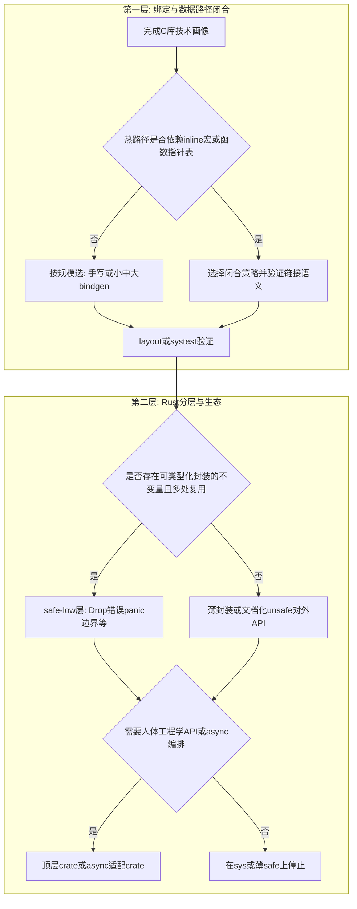

# 面向任意 C 库的 Rust FFI 方法论与检查表

本文从 [compare-projects.md](compare-projects.md) 的样本与 [rdma-ffi-schemes.md](rdma-ffi-schemes.md) 的「闭合策略」抽象出流程：**先做 C 库技术画像与绑定闭合决策，再做 Rust crate 分层、safe 边界与生态层**。设计产出请套用 [design-output-template.md](design-output-template.md)。

---

## 1. C 库技术画像（绑定前的输入）

在写 `build.rs` 或拆分 crate 之前，用下列维度描述目标 C 库（对应评审中的「输入画像」）。**这些问题的答案应驱动后续整棵树**，而不是先从「是否发 crates.io」入手。

| 维度 | 你要回答的内容 |
|------|----------------|
| **API 形态** | 句柄式、缓冲区式、回调式、对象式、状态机式、I/O 驱动式（或多类混合）。 |
| **ABI 与版本** | 是否稳定；版本跨度；是否需要构建期探测 + Rust `cfg` 分叉。 |
| **头文件与符号** | 是否存在 **`static inline`、宏函数**、变长结构、bitfield、`union`、**函数指针表（ops/vtable）**；热路径是否依赖「头文件即实现」。 |
| **资源与所有权** | 谁分配/释放；销毁顺序；错误路径是否泄漏句柄。 |
| **线程与全局态** | 全局 `init`；每线程上下文；C 是否可能**跨线程**调用 Rust 回调；allocator 约定。 |
| **链接与分发** | 系统库 / vendored / 静态 / 动态 **`dlopen`**；交叉编译；`links` 是否必要。 |
| **运行时集成** | 纯阻塞；**readiness**（`poll`/epoll）；**completion**（CQ 等）；**callback-driven**；是否与 Tokio 等同进程。 |

§1 与 [design-output-template.md](design-output-template.md) 第 1–2 节一致，可直接粘贴进设计文档。

---

## 2. 两层决策：绑定闭合 → crate 分层与生态

### 2.1 第一层：绑定生成与「数据路径闭合」

对任意 C 库，**绑定生成策略**与 **热路径能否仅靠 `extern "C"` 链接** 是核心架构选择，应进入主决策路径（而非仅作脚注）。

| 条件 | 倾向策略 |
|------|----------|
| 头文件简单、ABI 稳定、符号可由链接器解析 | **手写** `extern` 或 **小规模 bindgen**。 |
| 头文件大、类型多、随上游常变 | **bindgen** + allowlist/blocklist + 版本 **`cfg`**。 |
| **终端 `cargo build` 不能依赖 libclang** | **预生成**绑定检入仓库，或维持手写表面；维护者机器上跑生成器。 |
| **热路径落在 `static inline`/宏/`ops` 表**，且绑定生成器无法给出可链、语义正确的 Rust 调用 | 必须选 **闭合策略**（可组合）：在 **`-sys` 内 Rust 手写**等价派发；在 **safe 层**手写派发；**薄 C wrapper** 导出非 inline 符号；**静态桩 + `dlopen`/`dlsym`**；或 **窄符号集 + 依赖 `.so` 导出** 并验证链接矩阵。 |
| **`union`/布局极敏感** | **手写 `#[repr(C)]`** + **layout tests** / **ctest** / **systest**；避免盲信 bindgen 对疑难类型的默认输出。 |

**与 RDMA 的关系**：`libibverbs` / `verbs.h` 是第 4 行的典型案例；五种工程化闭合路线见 **[rdma-ffi-schemes.md](rdma-ffi-schemes.md)**。**同一逻辑适用于任何「头文件内联 + 函数指针派发」的 C 库**，不仅限于 RDMA。

### 2.2 第二层：是否需要 safe-low（修正「仅 no_std 才要 safe-low」）

**是否需要 safe-low（或等价模块）**，应问：

> **是否存在可用 Rust 类型系统封装的不变量，且上层（多处）要复用这些不变量？**

例如：复杂生命周期、统一错误映射、回调 **panic 隔离** 与 **pinning**、句柄 **`Drop`**、**`Send`/`Sync`/`!Send`** 的显式建模。**若答案为是，即应有 safe-low，与是否 `no_std`、是否「1:1 C 语义」无必然联系。** `zstd-safe` 的 `no_std` 只是其众多理由之一。

### 2.3 `links`、`-sys` 独立 crate、crates.io

在 **第一层与第二层的主干确定之后**，再决策：

- 是否单独发布 **`-sys`**、是否使用 **`links`**、feature 矩阵与 openssl/curl 类 **多依赖组合**。

这是 **Cargo 分发与构建集成** 问题，**不替代** §1 画像与 §2.1 闭合策略。

**与样本对应**（在主干确定后对照）：

- 薄 **`-sys`**：libz-sys。
- **`-sys` + safe-low + 人体工程学**：zstd-rs。
- **巨型版本矩阵 + 多 crate**：rust-openssl。
- **回调 + Multi + 全局 init**：curl-rust。

---

## 3. `*-sys` crate 设计要点

| 主题 | 建议 |
|------|------|
| `links` | 若会静态链接或参与全局注册，使用 `links` 并与文档说明「工作区内多 `-sys` 同名 links」的约束。 |
| `build.rs` 输出 | 使用 `cargo:rustc-cfg=...` 传递版本能力；`rerun-if-changed` / `rerun-if-env-changed` 保持可重现构建。 |
| 探测顺序 | 明确优先级（如：强制系统库 feature → pkg-config → vendored），与 libz-sys / curl-sys 一样写清 **为何** 跳过某路径（例如 FreeBSD 上避免污染 `-L`）。 |
| bindgen vs 预生成 | 头文件大、常变 → 倾向 bindgen；要 **可审计 diff**、CI 无 clang → **预生成**或手写为主（openssl/curl/rdma-io 各有取舍）。 |
| 依赖组合 | 若 C 库依赖 zlib/openssl，优先 **Rust 侧已有 `-sys`** 组合（curl-sys 依赖 libz-sys），避免重复符号。 |

---

## 4. safe API 准入标准（何种 API 可标 `safe`）

安全中间层**职责**（`Drop`、newtype、`unsafe` 集中、错误映射）仍适用，但需增加 **准入判定**，避免「包一层 `Drop` 即安全 API」的误解。

**倾向提供 `pub fn` 级别 `safe` 当且仅当**在文档中可明确承诺：

- Rust 侧能验证或要求调用方已验证：**指针非空**、**长度与生命周期**覆盖本次 C 调用。
- C **不会**在回调之外长期保存指针，或保存期已被类型/生命周期/ `'static` 闭包约束表达。
- **`Drop` 顺序**与 C 库要求一致；错误路径不泄漏句柄。
- 缓冲区若由 C **未初始化写入**，已在 API 形状上表达（如 `MaybeUninit`、输出切片由调用方提供）。

**应保持 `unsafe` 或受控构造器（builder / token / guard）当**：

- C 会 **保存指针或回调** 且保存期**不能**用 Rust 生命周期表达。
- C 可能 **跨线程** 调用回调，而 Rust 侧无法用 `Send`/`Sync` 约束调用方。
- 存在 **aliasing / 可变性** 约束无法用 `&` / `&mut` 安全表达。
- 任意误用会导致 **UB** 且无法在 safe 函数先验拒绝。

---

## 5. `Send` / `Sync`：五种 C 语义与 Rust 类型策略

在「默认不盲派」之上，新项目应**分别**对 **原始句柄**、**owned 包装**、**borrowed 视图**、**回调闭包** 做表。

| C / 文档语义 | 典型场景 | Rust 类型策略 |
|--------------|----------|----------------|
| **全局线程安全** | 文档声明全 API 可多线程 | 可对 **owned** 包装审慎实现 `Sync`；仍核实是否有隐藏线程局部状态。 |
| **对象级线程安全** | 每对象一把锁或原子 | `Arc<Inner>` + `Mutex`/`RwLock`；或文档 + 单线程类型。 |
| **仅单线程使用** | 多数 legacy SSL/句柄 | **`!Send`**（如 `PhantomData<Rc<()>>`）或文档 + runtime 断言。 |
| **每线程上下文** | TLS 式 context | **thread-local**；句柄 **`!Send`** 或带 thread-id guard。 |
| **C 跨线程调 Rust 回调** | 异步完成、多线程引擎 | 闭包要求 **`Send + 'static`**（或明确 `'callback` 与 C 契约）；panic 策略见检查表。 |

**polling / worker 线程所有权**：若库要求「仅 poll 线程触达 CQ」，可引入 **`PollGuard`** 或 token，把能力限制在持有 guard 的代码路径上。

---

## 6. 可打印检查表（绑定维护者用）

复制到 issue/PR 模板或内部 wiki。

### 构建与发布

- [ ] `build.rs` 在「无 pkg-config / 无网络」环境下行为明确（失败信息可行动）。
- [ ] 交叉编译所需环境变量已文档化（参考 openssl 的 `TARGET_OPENSSL_*` 模式）。
- [ ] `links` 与静态链接组合不会与工作区其他 crate 冲突，或已说明规避方式。
- [ ] features 语义在 README 中说明默认值与互斥组合。

### 安全与 FFI

- [ ] 所有 **C→Rust 回调** 路径已考虑 panic（`catch_unwind` 或 `std::panic::abort` 策略二选一且文档化）。
- [ ] 不在回调里做 **分配器假设**（除非 C 与 Rust 统一使用同一分配策略）。
- [ ] 不在 safe API 中暴露 **未初始化或悬垂** 缓冲区的构造方式。
- [ ] `Drop` 顺序与 C 库要求的销毁顺序一致（多资源时注意 drop 顺序与 `ManuallyDrop`）。
- [ ] **safe API 准入**（§4）已对每个 `pub fn` 做过归类，未标记的 `unsafe` 有 **Safety** 注释。

### 错误与诊断

- [ ] 错误类型实现 `std::error::Error`，必要时 `source` 链到下层。
- [ ] 长字符串/栈错误（OpenSSL 风格）有明确获取与清空策略，避免测试间污染。

### 生态与异步

- [ ] 文档说明 **阻塞点**（I/O、DNS、压缩级别）及推荐 async 用法（见 [async-ecosystem.md](async-ecosystem.md) 含 **§1.1 决策表**）。
- [ ] 若提供 `Multi` 类接口，说明与具体 runtime 的集成示例或指向生态 crate。

### RDMA / libibverbs（可选）

- [ ] 头文件含 **`static inline` + `ops` 派发** 时，已选定 **inline 闭合策略**（见 [rdma-ffi-schemes.md](rdma-ffi-schemes.md)），且未默认「仅 bindgen 即可 post/poll」。
- [ ] README 写明 **CQ 轮询 / completion channel** 与 **Tokio 同进程**时的线程分工（参考 [async-ecosystem.md](async-ecosystem.md) §5）。

### 测试与验证（FFI 安全主张的可证据）

- [ ] **ABI / 布局**：bindgen layout tests、**ctest**/**systest**、或与上游头文件对照的静态断言（至少选一种覆盖关键 `#[repr(C)]`）。
- [ ] **CI 矩阵**：多版本 C 库（若适用）；动态 / 静态 / vendored / 系统库组合至少 smoke。
- [ ] **交叉编译**：目标 triple 至少一次 `cargo check`。
- [ ] **运行时错误检测**：ASan/TSan/UBSan 或 valgrind（在团队流程允许范围内）。
- [ ] **Miri**：对 **纯 Rust safe 层**可测逻辑考虑 `cargo miri test` 范围（FFI 本体通常不在 Miri 内）。
- [ ] **回调 panic**：测试 `catch_unwind` 路径与 C 再入行为。
- [ ] **Drop / 错误路径**：泄漏测试（资源计数、mock allocator 等，按项目可行性）。

---

## 7. 反例速记

| 反例 | 后果 |
|------|------|
| 回调里 panic 直接 unwind 到 C | UB / 进程异常；平台相关。 |
| 多个 `-sys` 静态链同一 C 库 | 重复符号或 ODR 问题。 |
| safe 函数仅因「我测过」标 `Send` | 数据竞争或 C 侧未定义行为。 |
| `build.rs` 无条件 `println!("cargo:rustc-link-search=/usr/lib")` | 链到错误版本的系统库（libz-sys 注释的问题）。 |
| 仅有设计检查表、无 layout/systest | 安全主张难以在回归中证明。 |

---

## 8. 设计产出与延伸阅读

- **新项目**：按 [design-output-template.md](design-output-template.md) 输出完整设计文档后再开干。
- **样本对照**：[compare-projects.md](compare-projects.md) 中的 **架构决策矩阵**。
- **异步选型**：[async-ecosystem.md](async-ecosystem.md) §1.1。
- **libibverbs 案例**：[rdma-ffi-schemes.md](rdma-ffi-schemes.md)。

完成对比阅读后，可结合 [async-ecosystem.md](async-ecosystem.md) 规划异步边界。绑定 **libibverbs** 时另见 [rdma-ffi-schemes.md](rdma-ffi-schemes.md)。
