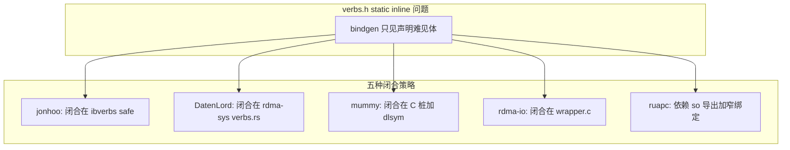

# RDMA（libibverbs / librdmacm）Rust FFI 方案总览

本文把工作区 **[rdma/docs/ffi-schemes/](../rdma/docs/ffi-schemes/README.md)** 中归纳的五条 **主线 FFI 架构**（外加并发专题）压缩成一份「可放进 ffi-docs 总册」的导读：各方案的**出发点**、**分层**、**如何解决 `verbs.h` 里 `static inline` + `ops` 表**、以及与 [compare-projects.md](compare-projects.md) 里通用 `-sys` 模式的类比。

**详细专题与代码引用**仍以 `rdma/docs/ffi-schemes/` 下各篇为准；本文不重复长篇附录（如 C/Rust 高并发示意），只给架构地图与选型指针。

---

## 1. 问题共性：为何 RDMA FFI 比普通 `-sys` 更难

| 现象 | 后果 |
|------|------|
| `verbs.h` 大量 **`static inline`** | bindgen 往往**不生成**可调用的、与运行时 `context->ops` 一致的 Rust 函数体。 |
| 热点路径走 **函数指针派发**（`post_send`、`poll_cq` 等） | 仅生成 `extern "C"` 声明可能**链接不到**或语义与 inline 不等价。 |
| 常需 **ibverbs + rdmacm** | 分层时要决定是否在**同一 `-sys`** 覆盖 CM，或依赖上层组合。 |
| 高并发语义在 **硬件队列 + CQ** | 与 Rust `async/await` **解耦**：见 [async-ecosystem.md](async-ecosystem.md) 中 RDMA 小节及 [concurrency-threading-async-vs-sync.md](../rdma/docs/ffi-schemes/concurrency-threading-async-vs-sync.md)。 |

因此 RDMA 绑定几乎总要在以下路径中选其一二（或组合）：**Rust 手写派发**、**safe 层派发**、**薄 C wrapper**、**mummy 桩 + dlopen**、**依赖 `.so` 导出符号的窄 bindgen**。

上述五种是 **「头文件内联 / 函数指针表参与热路径」** 时的工程化闭合策略；**已提升到通用方法论** [methodology-any-c-project.md](methodology-any-c-project.md) §2.1，RDMA 仅作最典型案例。下文表格仍按 libibverbs 工程命名，便于与工作区 `rdma/docs/ffi-schemes/` 对照。

---

## 2. 五条主线对照表

| 路线 | 代表工程（文档） | 头文件来源 | 解决 inline / 热点的位置 | 消费者 `cargo build` 是否跑 bindgen | 典型上层 |
|------|------------------|------------|-------------------------|--------------------------------------|----------|
| A1 | [jonhoo / rust-ibverbs](../rdma/docs/ffi-schemes/bindgen-vendored-headers-fnptr-in-safe-layer.md) | vendor rdma-core（cmake） | **`ibverbs` safe 层** 内 `ops` 指针派发 | **是** | `ibverbs` |
| A2 | [DatenLord / rdma-sys](../rdma/docs/ffi-schemes/bindgen-system-headers-manual-inline-in-sys.md) | 系统 pkg-config | **`rdma-sys` 内 `verbs.rs`** 手写 `#[inline] pub unsafe fn` | **是** | `async-rdma` |
| B1 | [rdma-mummy-sys + sideway](../rdma/docs/ffi-schemes/mummy-stub-bindgen-static-stub-dlopen-runtime.md) | mummy 捆绑头 | **C 桩** 提供稳定 `extern "C"`，运行时 **dlopen/dlsym** | **是**（对桩） | `sideway` |
| B2 | [rust-rdma-io / rdma-io-sys](../rdma/docs/ffi-schemes/c-wrapper-pregenerated-bnd-sys-headers.md) | 系统（维护者侧） | **`wrapper.c` 薄 `rdma_wrap_*`**，C 编译器展开 inline | **否**（绑定预生成） | `rdma-io` 等 |
| C | [ruapc-rdma-sys](../rdma/docs/ffi-schemes/bindgen-system-subset-postprocess-ruapc.md) | 系统 pkg-config | **窄 allowlist** + 依赖 **`.so` 导出符号** + **`syn` AST** 后处理强类型 | **是** | ruapc 其它 crate |

各专题全文、bindgen 总览表与「其它 FFI 路线」仍以 **[rdma/docs/ffi-schemes/README.md](../rdma/docs/ffi-schemes/README.md)** 为准。

---

## 3. 架构分层（mermaid）

与通用「C → `-sys` → safe → 可选 async」一致，RDMA 的差异在于 **`-sys` 是否自闭环 verbs 热点**。

**上层 crate 共性**：`sideway`、`async-rdma`、`rdma-io` 等 **不再重复 bindgen rdma-core**（各自文档有说明）；FFI 噪声集中在 `-sys`（或预生成 sys）一层。

---

## 4. 与 `ffi-docs` 通用样本的类比（帮助迁移心智）

| 通用样本（见 compare-projects） | RDMA 中相近的「痛点」或「解法」 |
|--------------------------------|----------------------------------|
| **libz-sys**：薄 `-sys`、`links` | RDMA 也有 `links` 与多 crate 组合链库问题；verbs 比 zlib **更不适**合纯薄 sys **无补丁**。 |
| **zstd-rs：`zstd-safe` 闭合 + `zstd-sys`** | 最接近 **DatenLord**：**`-sys`（+手写）自闭环**，上层做人体工程学 / async。 |
| **rust-openssl：版本 cfg + 多 crate** | 接近 **多后端 / 多探测** 复杂度；RDMA 还有 **mummy / vendor / 系统头** 分叉。 |
| **curl-rust：回调 + Panic 隔离** | RDMA 若做 **异步完成回调进 Rust**，同样需要 **panic 边界**；多数 verbs 栈是 **同步 post/poll**，回调问题少于 curl。 |

**回灌到通用方法论**：上述「inline / ops / 预生成 / 桩」已写入 [methodology-any-c-project.md](methodology-any-c-project.md) §2.1（不限于 RDMA）；safe 边界与 `Send`/`Sync` 见同文 §4–§5。新项目设计产出见 [design-output-template.md](design-output-template.md)。

---

## 5. 选型一句话（约束驱动）

更完整的决策表与「社区默认叙事」见 [rdma/docs/ffi-schemes/README.md §业界最佳实践](../rdma/docs/ffi-schemes/README.md) 一节。此处只保留与 `ffi-docs` 方法论对齐的压缩版：

| 你的约束 | 优先考虑 |
|----------|----------|
| 与 Rust Book 叙事一致、接受装 `-dev`、希望 **只依赖一个 sys 就能 post/poll** | **DatenLord `rdma-sys` 类**（系统头 + bindgen + **`verbs.rs`**） |
| 希望 **CI/docs 弱化系统 `-dev`**、绑定仍可对桩生成 | **mummy** 或 **vendor 头 + bindgen**（jonhoo） |
| 要强绑定 **可审计 diff**、终端构建 **不跑 libclang** | **预生成绑定**（`rdma-io-sys` 的 bnd，或 bindgen 输出检入仓库） |
| 只要 **窄子集** + **serde / schema** + 控制面工具 | **ruapc-rdma-sys** 类 |
| 教学、与「类型在 sys、热路径在 safe」心智一致 | **jonhoo `ibverbs-sys` + `ibverbs`**（inline 在 **safe** 层闭合） |

---

## 6. 并发与异步：读哪篇

RDMA 的高吞吐 **不依赖** Rust `async` 关键字；**`async-rdma`** 是主线方案里唯一把 **Tokio 级异步产品化**作为清晰边界的上层。

- **线程模型、perftest 范式、`spawn_blocking` 边界**：必读 [concurrency-threading-async-vs-sync.md](../rdma/docs/ffi-schemes/concurrency-threading-async-vs-sync.md)。
- **与 Tokio TCP 同进程桥接**：同一文档 §12–§13。

本地工作区源码树索引见 [rdma/docs/ffi-schemes/README.md §工作区对照](../rdma/docs/ffi-schemes/README.md)。

---

## 7. 维护说明

- **权威长文**：`rdma/docs/ffi-schemes/` 下各专题。
- **本文件**：供 `ffi-docs` 读者从「通用 FFI 样本」切到「RDMA 专用分叉」时 **单点入口**；若上游 README 结构调整，请同步更新本文 §2 的链接表。
