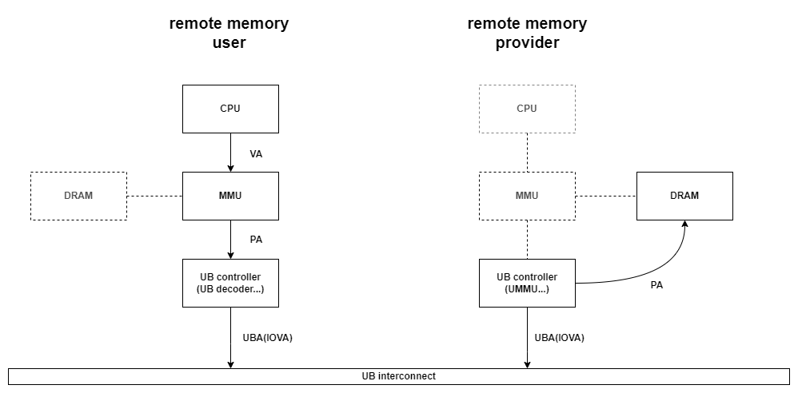

# obmm: 基于所有权的内存管理组件

OBMM 是在单机内管理远端内存的基础组件，可以将本地内存导出（export），将其他系统导出的内存引入（import）。export、import 两端的 OBMM 组件依次完成数据通路配置后，import 侧的应用可以像使用本端内存一样，使用 `load` 、`store` 访问远端内存。

OBMM 组件包含用户态库 libobmm.so（详见libobmm(3)） 和内核模块 obmm.ko。本文档介绍 obmm 内核模块功能和参数描述。

OBMM 具备两方面的功能：

* 芯片使能：配置芯片通路，使得 `load`、`store` 指令可以在物理上跨 host 执行
* 软件使能：为远端内存创建易用的软件使用接口，主要包括 remote NUMA 和 OBMM 字符设备（obmm_shmdev(4)）

OBMM 内核模块插入后，会生成一个 misc 设备 /dev/obmm。该设备通过 ioctl(2) 与用户态（主要是libobmm.so）交互，响应用户导出、引入等增删内存设备的请求。

## OBMM 数据通路

OBMM 内核模块可以发起多个 UB memory 访存相关的硬件配置

* MMU 页表
* UB memory decoder 翻译表（当前由管控组件配置）
* UMMU 翻译表

正确配置各组件后，数据通路将被打通，访存流程如下图所示（未显示response）



### decoder配置

UB memory decoder 由高可信硬件配置，使用方 OBMM 以高可信硬件提供的 PA 为起点，配置通路上的其他组件。

## OBMM 内存分配

### 内存来源

UB memory 对提供方的内存有连续性、缓存属性等方面的要求，因此一般要由 OBMM 统一分配。OBMM支持以下内存来源：

- hugetlb_pmd: 使用pmd映射的hugetlb的方式申请内存。此时每个本地NUMA节点配置的hugetlb页面为申请范围（详见`/sys/devices/system/node/node${numa_id}/hugepages/hugepages-2048kB/`）。
- hugetlb_pud: 使用pud映射的hugetlb的方式申请内存。此时每个本地NUMA节点配置的hugetlb页面为申请范围（详见`/sys/devices/system/node/node${numa_id}/hugepages/hugepages-1048576kB/`）。在此模式下，OBMM申请内存的粒度会变为1GB。该粒度会影响内存export和mempool申请内存。
- buddy_highmem: 使用高端地址的方式申请内存。此时pmd_mapping覆盖的部分为申请范围，但是申请范围不保证能被完全申请，这些内存被本地使用时，会持续尝试申请。

| 类型 | 申请内存来源 | 申请内存粒度 | UMMU页表粒度配置（支持2M，4M，……，256M \ 最大借出内存为128K * 2 * 页表粒度） | 其他限制 |
| --- | --- | --- | --- | --- |
| hugetlb_pmd | hugetlbfs中的pmd粒度大页 | PMD（PAGE_SIZE为4K时，PMD为2M） | 必须配置为2M | 仅支持pmd_mapping == 100%时使用，需要由用户或者kernel cmdline预留pmd大页内存 |
| hugetlb_pud | hugetlbfs中的pud粒度大页 | PUD（PAGE_SIZE为4K时，PUD为1G） | 可以配置为任意值（推荐32M） | 不受pmd_mapping限制，需要由用户或者kernel cmdline预留pud大页内存 |
| buddy_highmem | 直接从buddy或者使用pfn申请内存 | 通过驱动加载mem_allocator_granu参数配置，必须是UMMU页表粒度的整数倍 | 可以配置为任意值（推荐2M 或者32M） |  pmd_mapping配置的比例为各NUMA可借出内存比例的上限 |

内存来源在插入obmm.ko内核模块时通过mempool_allocator模块参数配置，不允许运行时修改，不允许多个内存来源共存。

### 内存池

为加速内存分配，OBMM 维护了一个可选的缓冲内存池。该内存池的大小、调整间隔由内核模块参数决定。导出内存时，会优先从缓冲内存池中申请内存，如果缓冲内存池中内存不足，再从上述内存源向系统申请内存。每隔一个调整间隔，OBMM会尝试将内存池填充至其目标大小。本地内存不足，触发OOM事件时，OBMM会将内存池中的内存还给系统使用，一段时间后再尝试重新填充该内存池。

内存池状态可通过 sysfs 查看，详见 obmm_mempool_sysfs(5)。

## OBMM 部署

### 内核启动项

OBMM内核模块依赖以下内核参数：
1. 若想要使用NUMA上线功能，需要配置numa_remote参数。若想要使用预上线功能，需进一步配置numa_remote=preonline。
    该参数详细说明如下：
```
    numa_remote=    [ARM64,KNL]
        Prepare unused NUMA Nodes as remote Nodes, allows to hotplug
        remote memory on these remote NUMA Nodes when CONFIG_NUMA_REMOTE
        is enabled. By default, all unused NUMA Nodes will be configured
        as remote Nodes. cmdline numa_remote_max_nodes can be used to limit
        the number of remote NUMA Nodes.
        Format [ard0,][arg1]
        preonline - allow to online unready memory and keep them isolated,
                    to improve the online performance.
        nonfallback - the remote nodes don't appear in the zonelists of
                      other nodes, the remote memory can only be allocated by
                      specifying the remote node.
        hugetlb_nowatermark - allocate hugetlb in remote node will ignore
                              watermark, and all memory can be allocated as
                              hugetlb.
        <int> - limit the number of remote NUMA Nodes.
```
2. 为了申请内存时正确修改内核页表属性，需要配置pmd_mapping参数。
    mempool_allocator配置成buddy_highmem时，需要配置pmd_mapping参数，该参数配置比例的系统内存为最大可借出内存；配置成hugetlb_pmd时，需要配置pmd_mapping=100%。
    该参数详细说明如下：
```
    pmd_mapping=    [ARM64,KNL]
            Format: nn%
            Allows to allocate contiguous memory from special pfn
            range, the liner mapping granule of this ranfe is never
            larger than PMD. pmd_mapping specifies the percent of
            memory of each node. pmd_mapping=100% is used for hugetlb
            scenarios, the whole linear mapping isn't large than PMD.
```

###前置内核模块依赖
除了模块本身依赖的ubus，ubcore，hisi_ummu_core，hisi_soc_cache_framework驱动外，为了正确使能刷cache功能，需要插入hisi_soc_hha模块。
依赖的模块中，以下参数会对OBMM的导入导出产生影响：
- UMMU 模块 ubm_granule参数影响OBMM分配的连续内存最小粒度。该参数配置为0以外的值时，OBMM申请内存的最小粒度须相应提升, 需正确选择内存来源。

### OBMM模块参数

OBMM 内核模块为 `obmm.ko` ，支持下列 4 个内核启动参数：

1. **mempool_size=(\\d+)[KMG]**：用于配置OBMM缓冲内存池的大小，默认为1G。指定OBMM维护的内存池的容量上限。内存池容量会被每个本地NUMA节点均分，例如mempool_size=4G，有4个本地NUMA节点时，OBMM会为每个本地NUMA缓冲至多1G内存。OBMM会动态、异步地从内存源申请释放内存，将缓冲内存池的大小维持在预期大小上下，用于提升内存的借出速度。
2. **mempool_refill_timeout=(\\d+)**：用于指示本地内存不足触发OBMM缓冲池释放后，OBMM尝试重新扩充内存池的时间间隔，单位为毫秒，默认为30000。OBMM在收到内核内存不足的通知时，会评估是否可通过释放缓冲池的缓冲内存以缓解系统内存不足的问题。如果有缓解效果，OBMM会释放全部内存池内存，并在mempool_refill_timeout毫秒后重新尝试内存池填充。
3. **mempool_allocator**：用于指定OBMM导出内存时的内存来源。当前支持hugetlb_pmd, hugetlb_pud, buddy_highmem三种内存来源。未指定时，默认为buddy_highmem。hugetlb_pmd和hugetlb_pud表示内存来自Linux hugetlbfs，内存需要在sysfs中手动预留后方可使用。仅当pmd_mapping=100%时，mempool_allocator允许使用hugetlb_pmd。buddy_highmem表示内存来自Linux内核的buddy allocator，内核会尝试动态组合buddy allocator中的页以满足OBMM的粒度要求。
4. **mem_allocator_granu=(\\d+)**：用于指定OBMM导出内存的粒度。每个单位的内存物理地址连续，用于满足UMMU硬件的要求。当内存分配器是buddy_highmem时，mem_allocator_granu必须是2的幂，且需要大于PMD_SIZE（4K页场景下为2M）。hugetlb_pmd仅支持PMD_SIZE为唯一粒度（4K页场景下为2M），hugetlb_pud仅支持PUD_SIZE为唯一粒度（4K页场景下为1G）。


## OBMM 设备

OBMM 内核模块插入后，会生成 `/dev/obmm` 设备。用户应通过 libobmm(3) 描述的函数接口来调用 OBMM 功能，不建议直接操作该设备。
